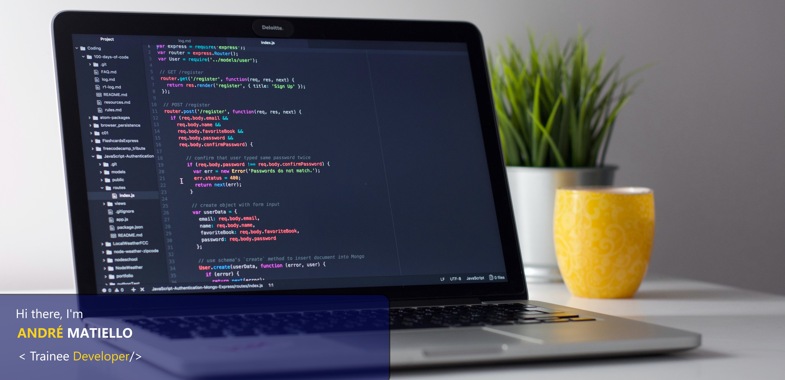

<!-- *********************************** Banner ************************************************ -->

<!-- ****************************************** Bio ******************************************** -->
##

### About

Currently, I'm Captain of the Military Police of the State of São Paulo. 
Curious, studying and learning [Front] HTML5, CSS3 and JavaScript, [Back] Node.JS, [Data] PostgreSQL, MongoDB, beyond Git and Github, have a little experience in software design and development. 
Huge fan of @cursoemvideo, @cataline.io, @alura, @gamaacademy, @rocketseat and @digitalinnovationone 
#motivated #alwaysLearning #keepStudying

<!-- ****************************************** Stack ****************************************** -->
##
### Stack

  
  
  
  
  
  
  

<!-- ****************************************** Contact ****************************************** -->
##
### Contact

LinkedIn: www.linkedin.com/in/andrematiello/ 
Site: coming soon 
E-mail: matiello.andre@hotmail.com 

<!-- ****************************************** Activity ***************************************** -->
##
### Activity

 
  <a href="https://github.com/andrematiello">
  
  

