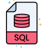

<!-- *********************************** Banner ************************************************ -->

<!-- ****************************************** Bio ******************************************** -->
##

### About

🲠🧑â€ğŸ’» Analytics Engineer | Data Analyst  
SQL | Python | ELT/ETL | Cloud (Azure and AWS) | Data Viz | Git | Docker | Apache Airflow | dbt | Jenkins 
Problem solver with a strong focus on Data Engineering and Analytics Engineering. Specialized in architecting and orchestrating scalable and reliable data pipelines, transforming complex and fragmented data sources into clean, well-structured datasets ready for analytics and business intelligence. Committed to ensuring data quality, reproducibility, and governance, supporting organizations in making data-driven decisions through automated and efficient ELT processes. 
First the method, then the tools!  
🔹️A long life learner! #alwaysLearning  
⚡️Captain of the Military Police - São Paulo/BR

<!-- ****************************************** Stack ****************************************** -->
##
### Stack and Environment

  
  
  
  
  
  
  
  
  
  
  
  

<!-- ****************************************** Contact ****************************************** -->
##
### Contact

LinkedIn: www.linkedin.com/in/andrematiello/ 
E-mail: matiello.andre@hotmail.com 
Site: coming soon 

<!-- ****************************************** Activity *****************************************

##
### Activity

  <a href="https://github.com/andrematiello">
  
  

-->
